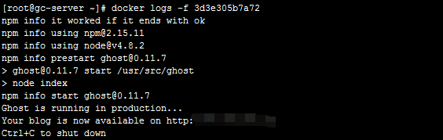

# docker_blog

    
## Docker环境下Ghost博客的搭建

ghost博客服务不再自己手动shell命令搭建，直接使用docker环境，目前（2018/04/18）官方镜像已经升级到1.22版本， 
默认数据库SQLite，我自己想使用mysql，找了下 `docker.io/thedigitalgarage/ghost-mysql`,这个镜像是满足要求的，
但是这个镜像当时应该还是以0.11版本做的，我就先凑合用了，等有空再来用最新的ghost镜像搞个mysql环境

默认latest

```sh
docker pull docker.io/thedigitalgarage/ghost-mysql
```

### Ghost 容器创建

按照 <https://hub.docker.com/r/thedigitalgarage/ghost-mysql/> 作者的说明，将对应的参数填好就ok了

执行下面的命令，这里的端口我自己的服务器上都没有暴露出来，不能在外网访问，起两个容器是想要后边使用nginx来进行代理使用

```sh
#两个节点 8081,8082  MYSQL_SERVICE_HOST可以用内网ip  GHOST_URL 申请域名之后修改成域名,没申请之前可以先用外网ip
docker run -d 
-e GHOST_URL=xxx.xxx.xxx.xxx 
-e MYSQL_SERVICE_HOST=xxx.xxx.xxx.xxx
-e MYSQL_USER=user 
-e MYSQL_PASSWORD=user
-e MYSQL_DATABASE=ghost 
--restart=always 
-p 8081:2368  
--name ghost_blog_one 
docker.io/thedigitalgarage/ghost-mysql

docker run -d 
-e GHOST_URL=xxx.xxx.xxx.xxx 
-e MYSQL_SERVICE_HOST=xxx.xxx.xxx.xxx 
-e MYSQL_USER=user 
-e MYSQL_PASSWORD=user
-e MYSQL_DATABASE=ghost 
--restart=always 
-p 8082:2368  
--name ghost_blog_two 
docker.io/thedigitalgarage/ghost-mysql
```

docker logs -f （containerId） 查看下，启动成功：




### Ghost镜像制作

看下Dockerfile  这个镜像是在ghost 0.11 基础上完成的 所以需要先去看下 ghost 镜像的 Dockerfile 

>  $GHOST_SOURCE: ghost资源路径  参见ghost 0.11版 Dockerfile 

```sh
FROM ghost

MAINTAINER Edward, eddsuarez89@gmail.com

# Add in better default config
ADD config.example.js config.example.js

# Add a few themes
COPY themes/bootstraptheme    content/themes/bootstraptheme
COPY themes/ghostium          content/themes/ghostium
COPY themes/ghostScroll       content/themes/ghostScroll
COPY themes/mapache-godofredo content/themes/mapache-godofredo
COPY themes/perfetta          content/themes/perfetta
COPY themes/portfolio         content/themes/portfolio
COPY themes/saga              content/themes/saga
COPY themes/webkid            content/themes/webkid

# Fix ownership in src
RUN chown -R user $GHOST_SOURCE/content
RUN chgrp -R 0 $GHOST_SOURCE
RUN chmod -R g+rw $GHOST_SOURCE
RUN find $GHOST_SOURCE -type d -exec chmod g+x {} +

# Install GIT
RUN apt-get update && apt-get install -y git

# Change to non-root user
USER user

# Default environment variables
ENV NODE_ENV production

# Port 2368 for ghost server
EXPOSE 2368
```

[thedigitalgarage作者的相关镜像资源][1]

[1]:https://github.com/thedigitalgarage/dg-ghost-mysql-container

这里利用作者给出的来做对应的镜像 因为这个镜像启动的容器在里面不好修改（我脑子笨，搞不了,大神当我没说。。。），
我这边需要修改下对应的主题模板 我将下载完的模板修改完之后重新导入不能解压，不知道是不是公司的加密软件的原因，我只好重新做了个镜像，
将改好的模板在做镜像的时候就添加进去直接使用了

这里重做一定要注意,版本号一定要加上，因为那个作者当时用的版本应该还没有1.xx版本，0和1的版本代码都不一样了 具体去看ghost的Dockerfile

>   FROM ghost:0.11.7

修改对应的资源之后 创建自己需要的镜像

```sh
#在Dockerfile文件目录下执行 
docker build -t ghost-test-0.11.7 .
```

